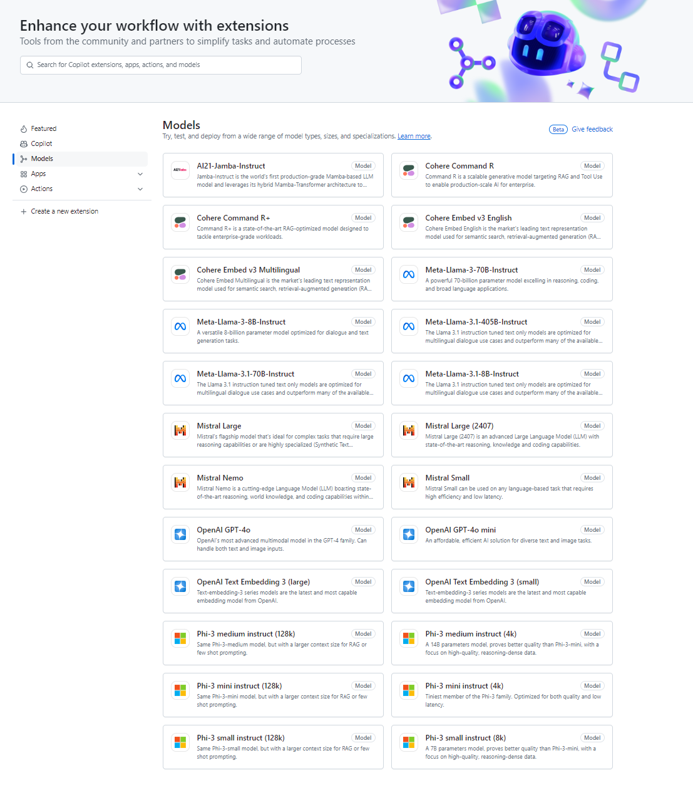
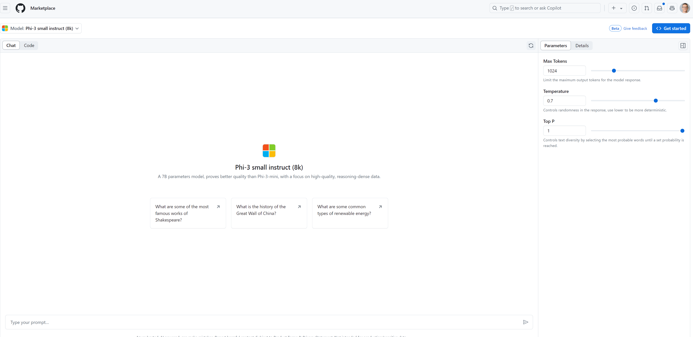
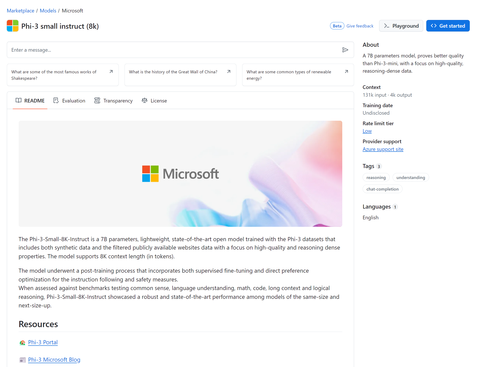

## GitHub Models - Limited Public Beta

Welcome to [GitHub Models](https://github.com/marketplace/models)! We've got everything fired up and ready for you to explore AI Models hosted on Azure AI.



For more information about the Models available on GitHub Models, check out the [GitHub Model Marketplace](https://github.com/marketplace/models)

## Models Available

Each model has a dedicated playground and sample code 



### Phi-3 Models in GitHub Model Catalog

[Phi-3-Medium-128k-Instruct](https://github.com/marketplace/models/azureml/Phi-3-medium-128k-instruct)

[Phi-3-medium-4k-instruct](https://github.com/marketplace/models/azureml/Phi-3-medium-4k-instruct)

[Phi-3-mini-128k-instruct](https://github.com/marketplace/models/azureml/Phi-3-mini-128k-instruct)

[Phi-3-mini-4k-instruct](https://github.com/marketplace/models/azureml/Phi-3-mini-4k-instruct)

[Phi-3-small-128k-instruct](https://github.com/marketplace/models/azureml/Phi-3-small-128k-instruct)

[Phi-3-small-8k-instruct](https://github.com/marketplace/models/azureml/Phi-3-small-8k-instruct)

## Getting Started

There are a few basic examples that are ready for you to run. You can find them in the samples directory. If you want to jump straight to your favorite language, you can find the examples in the following Languages:

- Python
- JavaScript
- cURL

There is also a dedicated Codespaces Environment for running the samples and models. 


## Sample Code 

Below are example code snippets for a few use cases. For additional information about Azure AI Inference SDK, see full documentation and samples.

## Setup 

1. Create a personal access token
You do not need to give any permissions to the token. Note that the token will be sent to a Microsoft service.

To use the code snippets below, create an environment variable to set your token as the key for the client code.

If you're using bash:
```
export GITHUB_TOKEN="<your-github-token-goes-here>"
```
If you're in powershell:

```
$Env:GITHUB_TOKEN="<your-github-token-goes-here>"
```

If you're using Windows command prompt:

```
set GITHUB_TOKEN=<your-github-token-goes-here>
```

## Python Sample

### Install dependencies
Install the Azure AI Inference SDK using pip (Requires: Python >=3.8):

```
pip install azure-ai-inference
```
### Run a basic code sample

This sample demonstrates a basic call to the chat completion API. It is leveraging the GitHub AI model inference endpoint and your GitHub token. The call is synchronous.

```
import os
from azure.ai.inference import ChatCompletionsClient
from azure.ai.inference.models import SystemMessage, UserMessage
from azure.core.credentials import AzureKeyCredential

endpoint = "https://models.inference.ai.azure.com"
# Replace Model_Name 
model_name = "Phi-3-small-8k-instruct"
token = os.environ["GITHUB_TOKEN"]

client = ChatCompletionsClient(
    endpoint=endpoint,
    credential=AzureKeyCredential(token),
)

response = client.complete(
    messages=[
        SystemMessage(content="You are a helpful assistant."),
        UserMessage(content="What is the capital of France?"),
    ],
    model=model_name,
    temperature=1.,
    max_tokens=1000,
    top_p=1.
)

print(response.choices[0].message.content)
```

### Run a multi-turn conversation

This sample demonstrates a multi-turn conversation with the chat completion API. When using the model for a chat application, you'll need to manage the history of that conversation and send the latest messages to the model.

```
import os
from azure.ai.inference import ChatCompletionsClient
from azure.ai.inference.models import AssistantMessage, SystemMessage, UserMessage
from azure.core.credentials import AzureKeyCredential

token = os.environ["GITHUB_TOKEN"]
endpoint = "https://models.inference.ai.azure.com"
# Replace Model_Name
model_name = "Phi-3-small-8k-instruct"

client = ChatCompletionsClient(
    endpoint=endpoint,
    credential=AzureKeyCredential(token),
)

messages = [
    SystemMessage(content="You are a helpful assistant."),
    UserMessage(content="What is the capital of France?"),
    AssistantMessage(content="The capital of France is Paris."),
    UserMessage(content="What about Spain?"),
]

response = client.complete(messages=messages, model=model_name)

print(response.choices[0].message.content)
```

### Stream the output

For a better user experience, you will want to stream the response of the model so that the first token shows up early and you avoid waiting for long responses.

```
import os
from azure.ai.inference import ChatCompletionsClient
from azure.ai.inference.models import SystemMessage, UserMessage
from azure.core.credentials import AzureKeyCredential

token = os.environ["GITHUB_TOKEN"]
endpoint = "https://models.inference.ai.azure.com"
# Replace Model_Name
model_name = "Phi-3-small-8k-instruct"

client = ChatCompletionsClient(
    endpoint=endpoint,
    credential=AzureKeyCredential(token),
)

response = client.complete(
    stream=True,
    messages=[
        SystemMessage(content="You are a helpful assistant."),
        UserMessage(content="Give me 5 good reasons why I should exercise every day."),
    ],
    model=model_name,
)

for update in response:
    if update.choices:
        print(update.choices[0].delta.content or "", end="")

client.close()
```
## JavaScript 

### Install dependencies

Install Node.js.

Copy the following lines of text and save them as a file package.json inside your folder.

```
{
  "type": "module",
  "dependencies": {
    "@azure-rest/ai-inference": "latest",
    "@azure/core-auth": "latest",
    "@azure/core-sse": "latest"
  }
}
```

Note: @azure/core-sse is only needed when you stream the chat completions response.

Open a terminal window in this folder and run npm install.

For each of the code snippets below, copy the content into a file sample.js and run with node sample.js.

### Run a basic code sample

This sample demonstrates a basic call to the chat completion API. It is leveraging the GitHub AI model inference endpoint and your GitHub token. The call is synchronous.

```
import ModelClient from "@azure-rest/ai-inference";
import { AzureKeyCredential } from "@azure/core-auth";

const token = process.env["GITHUB_TOKEN"];
const endpoint = "https://models.inference.ai.azure.com";
// Update your modelname
const modelName = "Phi-3-small-8k-instruct";

export async function main() {

  const client = new ModelClient(endpoint, new AzureKeyCredential(token));

  const response = await client.path("/chat/completions").post({
    body: {
      messages: [
        { role:"system", content: "You are a helpful assistant." },
        { role:"user", content: "What is the capital of France?" }
      ],
      model: modelName,
      temperature: 1.,
      max_tokens: 1000,
      top_p: 1.
    }
  });

  if (response.status !== "200") {
    throw response.body.error;
  }
  console.log(response.body.choices[0].message.content);
}

main().catch((err) => {
  console.error("The sample encountered an error:", err);
});
```

### Run a multi-turn conversation

This sample demonstrates a multi-turn conversation with the chat completion API. When using the model for a chat application, you'll need to manage the history of that conversation and send the latest messages to the model.

```
import ModelClient from "@azure-rest/ai-inference";
import { AzureKeyCredential } from "@azure/core-auth";

const token = process.env["GITHUB_TOKEN"];
const endpoint = "https://models.inference.ai.azure.com";
// Update your modelname
const modelName = "Phi-3-small-8k-instruct";

export async function main() {

  const client = new ModelClient(endpoint, new AzureKeyCredential(token));

  const response = await client.path("/chat/completions").post({
    body: {
      messages: [
        { role: "system", content: "You are a helpful assistant." },
        { role: "user", content: "What is the capital of France?" },
        { role: "assistant", content: "The capital of France is Paris." },
        { role: "user", content: "What about Spain?" },
      ],
      model: modelName,
    }
  });

  if (response.status !== "200") {
    throw response.body.error;
  }

  for (const choice of response.body.choices) {
    console.log(choice.message.content);
  }
}

main().catch((err) => {
  console.error("The sample encountered an error:", err);
});
```

### Stream the output
For a better user experience, you will want to stream the response of the model so that the first token shows up early and you avoid waiting for long responses.

```
import ModelClient from "@azure-rest/ai-inference";
import { AzureKeyCredential } from "@azure/core-auth";
import { createSseStream } from "@azure/core-sse";

const token = process.env["GITHUB_TOKEN"];
const endpoint = "https://models.inference.ai.azure.com";
// Update your modelname
const modelName = "Phi-3-small-8k-instruct";

export async function main() {

  const client = new ModelClient(endpoint, new AzureKeyCredential(token));

  const response = await client.path("/chat/completions").post({
    body: {
      messages: [
        { role: "system", content: "You are a helpful assistant." },
        { role: "user", content: "Give me 5 good reasons why I should exercise every day." },
      ],
      model: modelName,
      stream: true
    }
  }).asNodeStream();

  const stream = response.body;
  if (!stream) {
    throw new Error("The response stream is undefined");
  }

  if (response.status !== "200") {
    stream.destroy();
    throw new Error(`Failed to get chat completions, http operation failed with ${response.status} code`);
  }

  const sseStream = createSseStream(stream);

  for await (const event of sseStream) {
    if (event.data === "[DONE]") {
      return;
    }
    for (const choice of (JSON.parse(event.data)).choices) {
        process.stdout.write(choice.delta?.content ?? ``);
    }
  }
}

main().catch((err) => {
  console.error("The sample encountered an error:", err);
});
```

## REST 

### Run a basic code sample

Paste the following into a shell:

```
curl -X POST "https://models.inference.ai.azure.com/chat/completions" \
    -H "Content-Type: application/json" \
    -H "Authorization: Bearer $GITHUB_TOKEN" \
    -d '{
        "messages": [
            {
                "role": "system",
                "content": "You are a helpful assistant."
            },
            {
                "role": "user",
                "content": "What is the capital of France?"
            }
        ],
        "model": "Phi-3-small-8k-instruct"
    }'
```
### Run a multi-turn conversation

Call the chat completion API and pass the chat history:

```
curl -X POST "https://models.inference.ai.azure.com/chat/completions" \
    -H "Content-Type: application/json" \
    -H "Authorization: Bearer $GITHUB_TOKEN" \
    -d '{
        "messages": [
            {
                "role": "system",
                "content": "You are a helpful assistant."
            },
            {
                "role": "user",
                "content": "What is the capital of France?"
            },
            {
                "role": "assistant",
                "content": "The capital of France is Paris."
            },
            {
                "role": "user",
                "content": "What about Spain?"
            }
        ],
        "model": "Phi-3-small-8k-instruct"
    }'
```
### Stream the output

This is an example of calling the endpoint and streaming the response.

```
curl -X POST "https://models.inference.ai.azure.com/chat/completions" \
    -H "Content-Type: application/json" \
    -H "Authorization: Bearer $GITHUB_TOKEN" \
    -d '{
        "messages": [
            {
                "role": "system",
                "content": "You are a helpful assistant."
            },
            {
                "role": "user",
                "content": "Give me 5 good reasons why I should exercise every day."
            }
        ],
        "stream": true,
        "model": "Phi-3-small-8k-instruct"
    }'
```

## FREE Usage and Rate limits for GitHub Models



The [rate limits for the playground and free API usage](https://docs.github.com/en/github-models/prototyping-with-ai-models#rate-limits) are intended to help you experiment with models and prototype your AI application. For use beyond those limits, and to bring your application to scale, you must provision resources from an Azure account, and authenticate from there instead of your GitHub personal access token. You don't need to change anything else in your code. Use this link to discover how to go beyond the free tier limits in Azure AI.


### Disclosures

Remember when interacting with a model you are experimenting with AI, so content mistakes are possible.

The feature is subject to various limits (including requests per minute, requests per day, tokens per request, and concurrent requests) and is not designed for production use cases.

GitHub Models uses Azure AI Content Safety. These filters cannot be turned off as part of the GitHub Models experience. If you decide to employ models through a paid service, please configure your content filters to meet your requirements.

This service is under GitHub’s Pre-release Terms. 