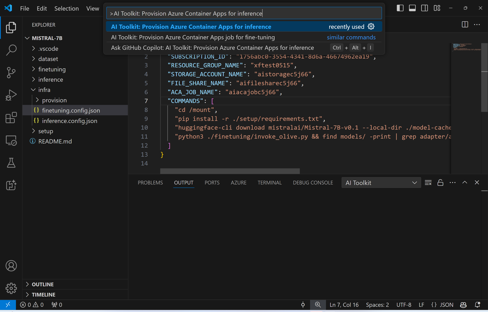
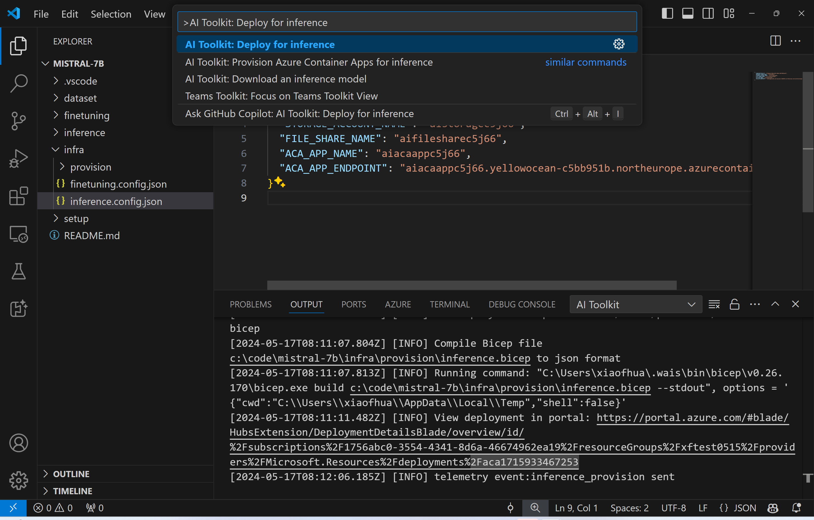

# 利用微调模型进行远程推理

在远程环境中训练适配器后，使用一个简单的 Gradio 应用与模型进行交互。


### 提供 Azure 资源
您需要在命令面板中执行 `AI Toolkit: Provision Azure Container Apps for inference` 来设置 Azure 资源以进行远程推理。在此设置过程中，系统将要求您选择 Azure 订阅和资源组。

   
默认情况下，推理所使用的订阅和资源组应与微调时使用的相匹配。推理将使用相同的Azure容器应用环境，并访问存储在Azure文件中的模型和模型适配器，这些文件是在微调阶段生成的。

## 使用 AI Toolkit 

### 推理部署  
如果您希望修改推理代码或重新加载推理模型，请执行 `AI Toolkit: Deploy for inference` 命令。这将使您的最新代码与ACA同步，并重新启动副本。



部署成功完成后，模型现在已准备好通过此端点进行评估。

### 访问推理 API

您可以通过单击VSCode通知中显示的 "*Go to Inference Endpoint*" 按钮来访问推理API。或者，可以在 `./infra/inference.config.json` 中的 `ACA_APP_ENDPOINT` 以及输出面板中找到 Web API 端点。


> **注意:** 推理端点可能需要几分钟时间才能完全运行。

## 模板中包含的推理组件
 
| 文件夹 | 内容 |
| ------ |--------- |
| `infra` | 包含远程操作所需的所有配置。|
| `infra/provision/inference.parameters.json` | 用于存储Bicep模板的参数，用于为推理提供Azure资源。 |
| `infra/provision/inference.bicep` | 包含用于为推理提供Azure资源的模板。 |
| `infra/inference.config.json` |通过 `AI Toolkit: Provision Azure Container Apps for inference` 命令生成的配置文件。它被用作其他远程命令面板的输入。|

### 使用 AI Toolkit 配置 Azure 资源
配置 [AI Toolkit](https://marketplace.visualstudio.com/items?itemName=ms-windows-ai-studio.windows-ai-studio)

为推理命令提供Azure容器应用程序。

您可以在下面的文件中找到配置参数： `./infra/provision/inference.parameters.json`. 下面是具体的参数说明:
| 参数 | 说明 |
| --------- |------------ |
| `defaultCommands` | 该参数是启动web API的命令。 |
| `maximumInstanceCount` | 该参数用于设置GPU实例的最大容量。 |
| `location` | 这是提供Azure资源的位置。默认值与所选资源组的位置相同。 |
| `storageAccountName`, `fileShareName` `acaEnvironmentName`, `acaEnvironmentStorageName`, `acaAppName`,  `acaLogAnalyticsName` | 这些参数用于命名要提供的Azure资源。默认情况下，它们将与微调资源名称相同。您可以输入一个新的、未使用的资源名称来创建您自己的自定义命名的资源，或者您也可以输入一个已经存在的Azure资源的名称(如果您愿意使用的话)。有关详细信息，请参阅 [Using existing Azure Resources](#using-existing-azure-resources). |

### 使用现有的 Azure 资源

默认情况下，推理供应将使用与微调相同的Azure容器应用环境、存储帐户、Azure文件共享和Azure日志分析。为推理API单独创建一个Azure容器应用。

如果您在微调步骤中自定义了Azure资源，或者您希望使用自己现有的Azure资源进行推理，请在 `./infra/inference.parameters.json` 文件中指定它们的名称。然后，从命令面板运行 `AI Toolkit: Provision Azure Container Apps for inference` 命令。这将更新任何指定的资源并创建任何缺失的资源。

例如，如果您已经拥有现有的Azure容器环境，那么您的 `./infra/finetuning.parameters.json` 文件应该如下所示:

```json
{
    "$schema": "https://schema.management.azure.com/schemas/2019-04-01/deploymentParameters.json#",
    "contentVersion": "1.0.0.0",
    "parameters": {
      ...
      "acaEnvironmentName": {
        "value": "<your-aca-env-name>"
      },
      "acaEnvironmentStorageName": {
        "value": null
      },
      ...
    }
  }
```

### 手动配置
如果您更喜欢手动配置Azure资源，可以在 `./infra/provision` 文件夹中使用提供的bicep文件。如果您在没有使用AI Toolkit命令面板的情况下设置并配置了所有Azure资源，那么只需在 `inference.config.json` 文件中输入资源名称即可。

例如:

```json
{
  "SUBSCRIPTION_ID": "<your-subscription-id>",
  "RESOURCE_GROUP_NAME": "<your-resource-group-name>",
  "STORAGE_ACCOUNT_NAME": "<your-storage-account-name>",
  "FILE_SHARE_NAME": "<your-file-share-name>",
  "ACA_APP_NAME": "<your-aca-name>",
  "ACA_APP_ENDPOINT": "<your-aca-endpoint>"
}
```
