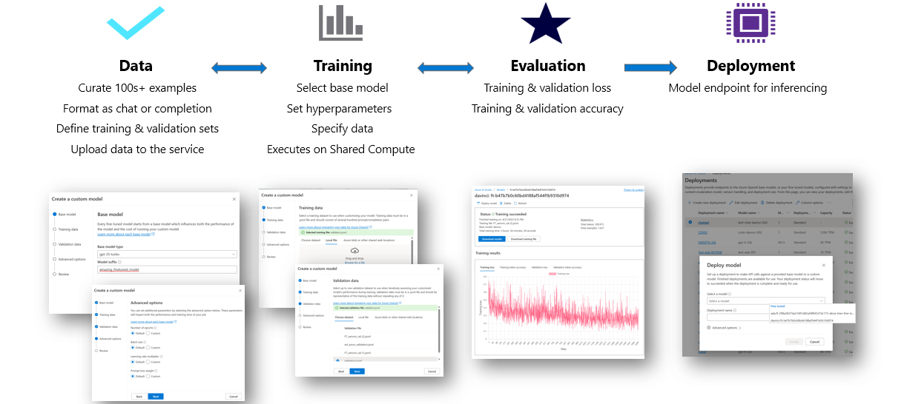
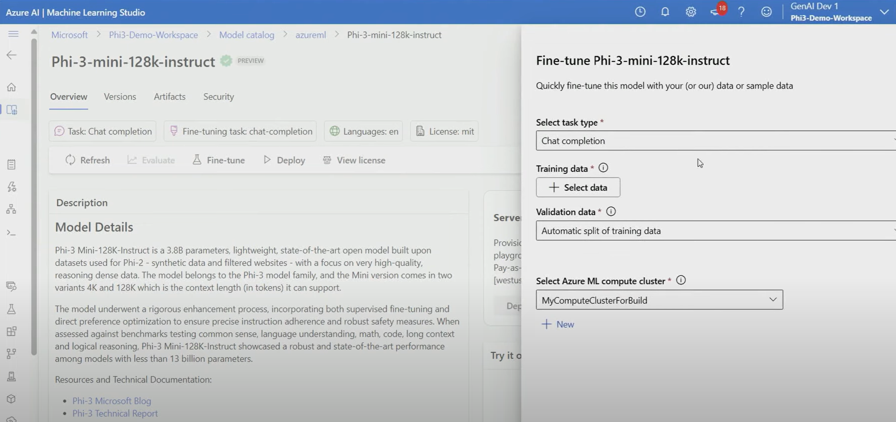
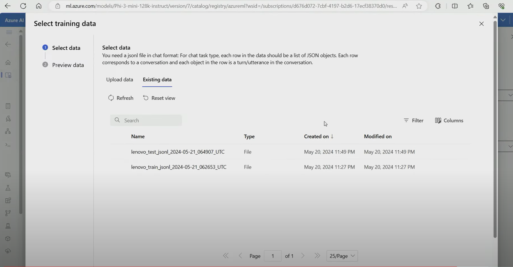
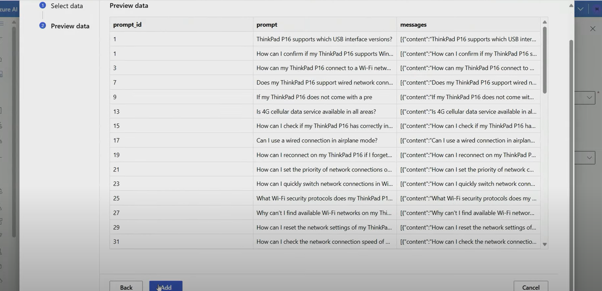

# **Fine-tuning Phi-3 with Azure AI Studio**

 Let’s explore how to fine-tune Microsoft’s Phi-3 Mini language model using Azure AI Studio. Fine-tuning allows you to adapt Phi-3 Mini to specific tasks, making it even more powerful and context-aware. 
 
## Considerations:

- **Capabilities:** Which models are fine tunable? What can the base model be fine tuned to do? 
- **Cost:** What’s the pricing model for fine tuning 
**Customizability:** How much can I modify the base model – and in what ways?
- **Convenience:** How does fine tuning actually happen – do I need to write custom code? Do I need to bring my own compute?
- **Safety:** Fine tuned models are known to have safety risks – are there any guardrails in place to protect against unintended harm?

 

Here are the steps to get started:

## Fine-Tuning Phi-3 with Azure AI Studio

**Set Up Your Environment**

Azure AI Studio: If you haven’t already, sign in to [Azure AI Studio](https://ai.azure.com?WT.mc_id=aiml-138114-kinfeylo).

**Create a New Project** 

Click on “New” and create a new project. Choose the appropriate settings based on your use case.

### Data Preparation

**Dataset Selection** 

Gather or create a dataset that aligns with your task. This could be chat instructions, question-answer pairs, or any relevant text data.

Select DataSet

Choose your DataSet

Preview DataSet

**Advanced Usage** 

**Data Preprocessing** 

Clean and preprocess your data. Remove noise, handle missing values, and tokenize the text.

## Model Selection

**Phi-3 Mini** 

You’ll be fine-tuning the pre-trained Phi-3 Mini model. Make sure you have access to the model checkpoint (e.g., "microsoft/Phi-3-mini-4k-instruct").

**Fine-Tuning Configuration**

Hyperparameters: Define hyperparameters such as learning rate, batch size, and number of training epochs.

**Loss Function** 

Choose an appropriate loss function for your task (e.g., cross-entropy).

**Optimizer**

Select an optimizer (e.g., Adam) for gradient updates during training.

**Fine-Tuning Process**

- Load Pre-Trained Model: Load the Phi-3 Mini checkpoint.
- Add Custom Layers: Add task-specific layers (e.g., classification head for chat instructions).

**Train the Model** 
Fine-tune the model using your prepared dataset. Monitor training progress and adjust hyperparameters as needed.

**Evaluation and Validation**

Validation Set: Split your data into training and validation sets.

**Evaluate Performance** 

Use metrics like accuracy, F1-score, or perplexity to assess model performance.

## Save Fine-Tuned Model

**Checkpoint** 
Save the fine-tuned model checkpoint for future use.

## Deployment

- Deploy as a Web Service: Deploy your fine-tuned model as a web service in Azure AI Studio.
- Test the Endpoint: Send test queries to the deployed endpoint to verify its functionality.

## Iterate and Improve

Iterate: If the performance isn’t satisfactory, iterate by adjusting hyperparameters, adding more data, or fine-tuning for additional epochs.

## Monitor and Refine

Continuously monitor the model’s behavior and refine as needed.

## Customize and Extend

Custom Tasks: Phi-3 Mini can be fine-tuned for various tasks beyond chat instructions. Explore other use cases!
Experiment: Try different architectures, layer combinations, and techniques to enhance performance.

***Note***: Fine-tuning is an iterative process. Experiment, learn, and adapt your model to achieve the best results for your specific task! 