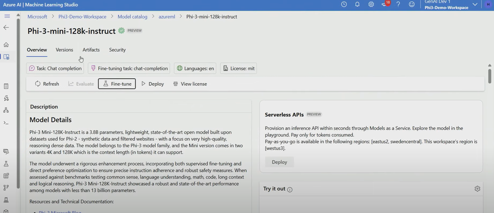

# **使用 Azure AI Studio 对 Phi-3 进行微调**

让我们探讨如何使用Azure AI Studio对微软的Phi-3 Mini语言模型进行微调。微调使您能够将Phi-3 Mini适应于特定任务，使其更加强大且具有上下文感知能力。
 
## 考虑因素:

- **功能:** 哪些模型可以进行微调？基础模型可以微调以执行哪些操作？
- **成本:** 微调的定价模式是什么？
- **可定制性:** 我可以在多大程度上修改基础模型 - 以及以何种方式？
- **便利性:** 微调实际上是如何进行的 - 我需要编写自定义代码吗？我需要提供自己的计算资源吗？
- **安全性:** 已知微调模型具有安全风险 - 是否有任何防护措施以防止意外伤害？

 

以下是上手的具体步骤:

## 使用 Azure AI Studio 对 Phi-3 进行微调

**设置您的环境**

Azure AI Studio: 如果您还没有，请登录 [Azure AI Studio](https://ai.azure.com?WT.mc_id=aiml-138114-kinfeylo).

**创建一个新项目** 

单击 "New" 创建一个新项目，根据您自身的用途选择合适的设置。

### 数据准备

**数据集选择** 

收集或创建与您的任务相符的数据集。这可以是聊天指令、问题-答案对或任何相关的文本数据。

选择数据集

选择您的数据集

预览数据集

**高级用法** 

**数据预处理** 

清理并预处理您的数据。去除噪声，处理缺失值，并对文本进行分词。

## 模型选择

**Phi-3 Mini** 

您将对预训练的Phi-3 Mini模型进行微调。确保您可以访问模型检查点 (例如, "microsoft/Phi-3-mini-4k-instruct").

**微调配置**

超参数：定义诸如学习率、批量大小和训练迭代次数等超参数。

**损失函数** 

为您的任务选择一个合适的损失函数（例如，交叉熵cross-entropy）。

**优化器**

选择一个优化器（例如，Adam），用于训练过程中的梯度更新。

**微调过程**

- 加载预训练模型：加载Phi-3 Mini检查点。
- 添加自定义层：添加特定任务的层（例如，用于聊天指令的分类头）。

**训练模型** 
使用您准备好的数据集对模型进行微调。监控训练进度并根据需要调整超参数。

**评估和验证**

验证集：将您的数据划分为训练集和验证集。

**评估性能** 

使用精度、F1-score、perplexity等指标来评估模型性能。

## 保存微调后的模型

**检查点** 
保存微调后的模型检查点以备将来使用。

## 部署

- 部署为Web服务：在Azure AI Studio中将微调后的模型部署为Web服务。
- 测试端点：向部署的端点发送测试请求以验证其功能。

## 迭代与提升

迭代：如果性能不满意，请通过调整超参数、添加更多数据或进行额外轮次的微调来进行迭代优化。

## 监控和优化

持续监控模型的行为，并根据需要进行优化。

## 定制和扩展

自定义任务：Phi-3 Mini 可以针对除聊天指令之外的各种任务进行微调。探索其他用例！
实验：尝试不同的架构、层组合和技术来提高性能。

***注意***: 微调是一个迭代过程。通过实验、学习和调整您的模型，为特定任务实现最佳结果！