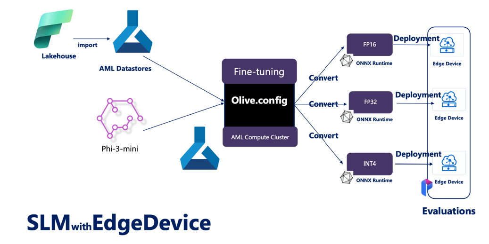

# **微調 Phi-3 與 Microsoft Olive**

[Olive](https://github.com/microsoft/OLive?WT.mc_id=aiml-138114-kinfeylo) 是一個易於使用的硬體感知模型優化工具，結合了業界領先的模型壓縮、優化和編譯技術。

它旨在簡化優化機器學習模型的過程，確保它們能最有效地利用特定硬體架構。

無論您是在雲端應用程式還是邊緣設備上工作，Olive 都能讓您輕鬆且有效地優化您的模型。

## 主要功能:

- Olive 聚合並自動化針對所需硬體目標的優化技術。
- 沒有單一的優化技術適用於所有情境，因此 Olive 通過允許行業專家插入他們的優化創新來實現可擴展性。

## 減少工程努力:

- 開發者經常需要學習和使用多個硬體供應商特定的工具鏈，以準備和優化訓練好的模型進行部署。
- Olive 通過自動化優化技術來簡化這種體驗，以適應所需的硬體。

## Ready-to-Use E2E Optimization Solution:

透過組合和調整整合技術，Olive 提供了端到端優化的統一解決方案。
它在優化模型時考慮了準確性和延遲等限制。

## 使用 Microsoft Olive 進行微調

Microsoft Olive 是一個非常易於使用的開源模型優化工具，可以涵蓋生成式人工智慧領域中的微調和參考。它只需要簡單的配置，結合使用開源的小語言模型和相關的執行環境（AzureML / 本地 GPU、CPU、DirectML），即可通過自動優化完成模型的微調或參考，並找到最佳模型部署到雲端或邊緣設備上。允許企業在本地和雲端構建自己的行業垂直模型。


## Phi-3 微調與 Microsoft Olive



## Phi-3 Olive 範例程式碼和範例

在這個範例中，你將使用 Olive 來：

- 微調一個 LoRA 適配器以將短語分類為 Sad、Joy、Fear、Surprise。
- 將適配器權重合併到基礎模型中。
- 優化並量化模型為 int4。

[範例程式碼](../../code/04.Finetuning/olive-ort-example/README.md)

### 設定 Microsoft Olive

Microsoft Olive 安裝非常簡單，並且也可以安裝於 CPU、GPU、DirectML 和 Azure ML

```bash
pip install olive-ai
```

如果你希望使用 CPU 執行 ONNX 模型，你可以使用

```bash
pip install olive-ai[cpu]
```

如果你想使用 GPU 執行 ONNX 模型，你可以使用

```python
pip install olive-ai[gpu]
```

如果你想使用 Azure ML，使用

```python
pip install git+https://github.com/microsoft/Olive#egg=olive-ai[azureml]
```

**注意**
作業系統需求 : Ubuntu 20.04 / 22.04

### **Microsoft Olive 的 Config.json**

安裝後，您可以通過 Config 檔案配置不同模型特定的設定，包括資料、計算、訓練、部署和模型產生。

**1. 資料**

在 Microsoft Olive 上，本地資料和雲端資料的訓練都可以支援，並且可以在設定中配置。

*本地資料設定*

您可以簡單地設定需要進行微調的數據集，通常是 json 格式，並使用數據模板進行適配。這需要根據模型的要求進行調整（例如，適配到 Microsoft Phi-3-mini 所需的格式。如果您有其他模型，請參考其他模型所需的微調格式進行處理)

```json

    "data_configs": [
        {
            "name": "dataset_default_train",
            "type": "HuggingfaceContainer",
            "load_dataset_config": {
                "params": {
                    "data_name": "json",
                    "data_files":"dataset/dataset-classification.json",
                    "split": "train"
                }
            },
            "pre_process_data_config": {
                "params": {
                    "dataset_type": "corpus",
                    "text_cols": [
                            "phrase",
                            "tone"
                    ],
                    "text_template": "### Text: {phrase}\n### The tone is:\n{tone}",
                    "corpus_strategy": "join",
                    "source_max_len": 2048,
                    "pad_to_max_len": false,
                    "use_attention_mask": false
                }
            }
        }
    ],
```

**雲端資料來源設定**

通過連接 Azure AI Studio/Azure Machine Learning Service 的資料存儲來連接雲端中的資料，您可以選擇通過 Microsoft Fabric 和 Azure Data 將不同的資料來源引入 Azure AI Studio/Azure Machine Learning Service，以支援對資料進行微調。

```json

    "data_configs": [
        {
            "name": "dataset_default_train",
            "type": "HuggingfaceContainer",
            "load_dataset_config": {
                "params": {
                    "data_name": "json",
                    "data_files": {
                        "type": "azureml_datastore",
                        "config": {
                            "azureml_client": {
                                "subscription_id": "Your Azure Subscrition ID",
                                "resource_group": "Your Azure Resource Group",
                                "workspace_name": "Your Azure ML Workspaces name"
                            },
                            "datastore_name": "workspaceblobstore",
                            "relative_path": "Your train_data.json Azure ML Location"
                        }
                    },
                    "split": "train"
                }
            },
            "pre_process_data_config": {
                "params": {
                    "dataset_type": "corpus",
                    "text_cols": [
                            "Question",
                            "Best Answer"
                    ],
                    "text_template": "<|user|>\n{Question}<|end|>\n<|assistant|>\n{Best Answer}\n<|end|>",
                    "corpus_strategy": "join",
                    "source_max_len": 2048,
                    "pad_to_max_len": false,
                    "use_attention_mask": false
                }
            }
        }
    ],

```

**2. 計算配置**

如果你需要本地化，你可以直接使用本地數據資源。你需要使用 Azure AI Studio / Azure Machine Learning Service 的資源。你需要配置相關的 Azure 參數、計算能力名稱等。

```json

    "systems": {
        "aml": {
            "type": "AzureML",
            "config": {
                "accelerators": ["gpu"],
                "hf_token": true,
                "aml_compute": "Your Azure AI Studio / Azure Machine Learning Service Compute Name",
                "aml_docker_config": {
                    "base_image": "Your Azure AI Studio / Azure Machine Learning Service docker",
                    "conda_file_path": "conda.yaml"
                }
            }
        },
        "azure_arc": {
            "type": "AzureML",
            "config": {
                "accelerators": ["gpu"],
                "aml_compute": "Your Azure AI Studio / Azure Machine Learning Service Compute Name",
                "aml_docker_config": {
                    "base_image": "Your Azure AI Studio / Azure Machine Learning Service docker",
                    "conda_file_path": "conda.yaml"
                }
            }
        }
    },
```

***注意***

因為它是通過 Azure AI Studio/Azure Machine Learning Service 上的容器執行的，所以需要配置所需的環境。這是在 conda.yaml 環境中配置的。

```yaml

name: project_environment
channels:
  - defaults
dependencies:
  - python=3.8.13
  - pip=22.3.1
  - pip:
      - einops
      - accelerate
      - azure-keyvault-secrets
      - azure-identity
      - bitsandbytes
      - datasets
      - huggingface_hub
      - peft
      - scipy
      - sentencepiece
      - torch>=2.2.0
      - transformers
      - git+https://github.com/microsoft/Olive@jiapli/mlflow_loading_fix#egg=olive-ai[gpu]
      - --extra-index-url https://aiinfra.pkgs.visualstudio.com/PublicPackages/_packaging/ORT-Nightly/pypi/simple/
      - ort-nightly-gpu==1.18.0.dev20240307004
      - --extra-index-url https://aiinfra.pkgs.visualstudio.com/PublicPackages/_packaging/onnxruntime-genai/pypi/simple/
      - onnxruntime-genai-cuda
```

**3. 選擇你的 SLM**

你可以直接從 Hugging face 使用該模型，或者你可以直接將其與 Azure AI Studio / Azure Machine Learning 的模型目錄結合使用來選擇要使用的模型。在下面的程式碼範例中，我們將使用 Microsoft Phi-3-mini 作為範例。

如果你在本地有這個模型，你可以使用這個方法

```json

    "input_model":{
        "type": "PyTorchModel",
        "config": {
            "hf_config": {
                "model_name": "model-cache/microsoft/phi-3-mini",
                "task": "text-generation",
                "model_loading_args": {
                    "trust_remote_code": true
                }
            }
        }
    },
```

如果你想使用來自 Azure AI Studio / Azure Machine Learning Service 的模型，你可以使用這個方法

```json

    "input_model":{
        "type": "PyTorchModel",
        "config": {
            "model_path": {
                "type": "azureml_registry_model",
                "config": {
                    "name": "microsoft/Phi-3-mini-4k-instruct",
                    "registry_name": "azureml-msr",
                    "version": "11"
                }
            },
             "model_file_format": "PyTorch.MLflow",
             "hf_config": {
                "model_name": "microsoft/Phi-3-mini-4k-instruct",
                "task": "text-generation",
                "from_pretrained_args": {
                    "trust_remote_code": true
                }
            }
        }
    },
```

**注意:**
我們需要與 Azure AI Studio / Azure Machine Learning Service 整合，因此在設定模型時，請參考版本號和相關命名。

Azure 上的所有模型都需要設定為 PyTorch.MLflow

你需要擁有一個 Hugging face 帳戶，並將金鑰綁定到 Azure AI Studio / Azure Machine Learning 的 Key 值。

**4. 演算法**

Microsoft Olive 封裝了 Lora 和 QLora 微調算法非常好。你只需要配置一些相關參數。這裡我以 QLora 為例。

```json
        "lora": {
            "type": "LoRA",
            "config": {
                "target_modules": [
                    "o_proj",
                    "qkv_proj"
                ],
                "double_quant": true,
                "lora_r": 64,
                "lora_alpha": 64,
                "lora_dropout": 0.1,
                "train_data_config": "dataset_default_train",
                "eval_dataset_size": 0.3,
                "training_args": {
                    "seed": 0,
                    "data_seed": 42,
                    "per_device_train_batch_size": 1,
                    "per_device_eval_batch_size": 1,
                    "gradient_accumulation_steps": 4,
                    "gradient_checkpointing": false,
                    "learning_rate": 0.0001,
                    "num_train_epochs": 3,
                    "max_steps": 10,
                    "logging_steps": 10,
                    "evaluation_strategy": "steps",
                    "eval_steps": 187,
                    "group_by_length": true,
                    "adam_beta2": 0.999,
                    "max_grad_norm": 0.3
                }
            }
        },
```

如果你想要量化轉換，Microsoft Olive 主分支已經支援 onnxruntime-genai 方法。你可以根據你的需求進行設定：

1. 將適配器權重合併到基礎模型中
2. 使用 ModelBuilder 將模型轉換為具有所需精度的 onnx 模型

例如轉換為量化的 INT4

```json

        "merge_adapter_weights": {
            "type": "MergeAdapterWeights"
        },
        "builder": {
            "type": "ModelBuilder",
            "config": {
                "precision": "int4"
            }
        }
```

**注意**

- 如果你使用 QLoRA，目前暫不支援 ONNXRuntime-genai 的量化轉換。

- 這裡需要指出的是，你可以根據自己的需求設定上述步驟。不必完全配置上述這些步驟。根據你的需求，你可以直接使用演算法的步驟而不進行微調。最後你需要配置相關引擎。

```json

    "engine": {
        "log_severity_level": 0,
        "host": "aml",
        "target": "aml",
        "search_strategy": false,
        "execution_providers": ["CUDAExecutionProvider"],
        "cache_dir": "../model-cache/models/phi3-finetuned/cache",
        "output_dir" : "../model-cache/models/phi3-finetuned"
    }
```

**5. 完成微調**

在命令列中，在 olive-config.json 的目錄中執行

```bash
olive run --config olive-config.json
```

