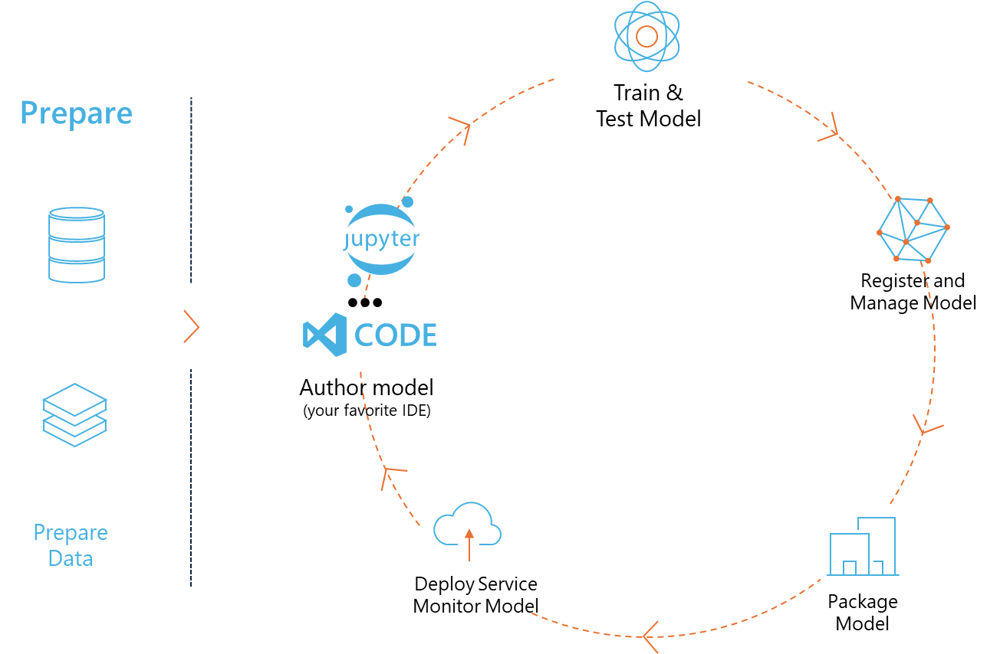

# **MLflow**

[MLflow](https://mlflow.org/) 是一個開源平台，旨在管理端到端的機器學習生命週期。



MLFlow 用於管理 ML 生命週期，包括實驗、可重現性、部署和中央模型註冊。ML flow 目前提供四個組件。

- **MLflow Tracking:** 記錄和查詢實驗、程式碼、數據配置和結果。
- **MLflow Projects:** 以一種格式封裝數據科學程式碼，以便在任何平台上重現執行。
- **Mlflow Models:** 在多種服務環境中部署機器學習模型。
- **Model Registry:** 在中央儲存庫中存儲、註釋和管理模型。

它包括追蹤實驗、將程式碼打包成可重現的執行以及共享和部署模型的功能。MLFlow 集成到 Databricks 並支持各種 ML 函式庫，使其與函式庫無關。它可以與任何機器學習函式庫和任何程式語言一起使用，因為它提供了 REST API 和 CLI 以方便使用。


MLFlow 的主要功能包括:

- **實驗追蹤:** 記錄和比較參數和結果。
- **模型管理:** 部署模型到各種服務和推論平台。
- **模型註冊:** 協作管理 MLflow 模型的生命週期，包括版本控制和註釋。
- **專案:** 將 ML 程式碼打包以便分享或生產使用。
MLFlow 也支持 MLOps 迴圈，包括準備資料、註冊和管理模型、打包模型以便執行、部署服務和監控模型。它旨在簡化從原型到生產工作流程的過程，特別是在雲端和邊緣環境中。

## **E2E Scenario - 建構一個包裝器並使用 Phi-3 作為 MLFlow 模型**

在這個 E2E 範例中，我們將展示兩種不同的方法來建構 Phi-3 小型語言模型（SLM）的包裝器，然後在本地或雲端（例如在 Azure 機器學習工作區）將其作為 MLFlow 模型執行。


| Project | Description | Location |
| ------------ | ----------- | -------- |
| Transformer Pipeline | Transformer Pipeline 是建構包裝器的最簡單選擇，如果你想使用 HuggingFace 模型與 MLFlow 的實驗性 transformers 風味。 | [**TransformerPipeline.ipynb**](E2E_Phi-3-MLflow_TransformerPipeline.ipynb) |
| Custom Python Wrapper | 在撰寫本文時，transformer pipeline 不支援 HuggingFace 模型的 ONNX 格式的 MLFlow 包裝器生成，即使使用實驗性的 optimum Python 套件也是如此。對於這種情況，你可以為 MLFlow 模式建構自訂的 Python 包裝器 | [**CustomPythonWrapper.ipynb**](E2E_Phi-3-MLflow_CustomPythonWrapper.ipynb)

## Project: Transformer Pipeline

1. 你將需要來自 MLFlow 和 HuggingFace 的相關 Python 套件:

``` Python
import mlflow
import transformers
```

2. 接下來，你應該透過參考 HuggingFace 註冊表中的目標 Phi-3 模型來啟動 transformer pipeline。如 _Phi-3-mini-4k-instruct_ 的模型卡所示，其任務屬於“文本生成”類型:

``` Python
pipeline = transformers.pipeline(
    task = "text-generation",
    model = "microsoft/Phi-3-mini-4k-instruct"
)
```

3. 你現在可以將你的 Phi-3 模型的 transformer pipeline 儲存為 MLFlow 格式，並提供額外的詳細資訊，如目標 artifacts 路徑、特定模型配置設定和推論 API 類型:

``` Python
model_info = mlflow.transformers.log_model(
    transformers_model = pipeline,
    artifact_path = "phi3-mlflow-model",
    model_config = model_config,
    task = "llm/v1/chat"
)
```

## Project: Custom Python Wrapper

1. 我們可以在這裡利用 Microsoft 的 [ONNX Runtime generate() API](https://github.com/microsoft/onnxruntime-genai) 來進行 ONNX 模型的推論和代碼編碼 / 解碼。你必須為你的目標計算選擇 _onnxruntime_genai_ 套件，以下範例針對 CPU:

``` Python
import mlflow
from mlflow.models import infer_signature
import onnxruntime_genai as og
```

2. 我們的自訂類別實作了兩個方法: _load_context()_ 來初始化 Phi-3 Mini 4K Instruct 的 **ONNX model**、**generator parameters** 和 **tokenizer**; 以及 _predict()_ 來為提供的提示生成輸出 tokens:

``` Python
class Phi3Model(mlflow.pyfunc.PythonModel):
    def load_context(self, context):
        # 從 artifacts 中檢索模型
        model_path = context.artifacts["phi3-mini-onnx"]
        model_options = {
             "max_length": 300,
             "temperature": 0.2,
        }

        # 定義模型
        self.phi3_model = og.Model(model_path)
        self.params = og.GeneratorParams(self.phi3_model)
        self.params.set_search_options(**model_options)

        # 定義 tokenizer
        self.tokenizer = og.Tokenizer(self.phi3_model)

    def predict(self, context, model_input):
        # 從輸入中檢索 prompt
        prompt = model_input["prompt"][0]
        self.params.input_ids = self.tokenizer.encode(prompt)

        # 生成模型的回應
        response = self.phi3_model.generate(self.params)

        return self.tokenizer.decode(response[0][len(self.params.input_ids):])
```

3. 你現在可以使用 _mlflow.pyfunc.log_model()_ 函式來產生 Phi-3 模型的自訂 Python 包裝器（pickle 格式），以及原始的 ONNX 模型和所需的相依性:

``` Python
model_info = mlflow.pyfunc.log_model(
    artifact_path = artifact_path,
    python_model = Phi3Model(),
    artifacts = {
        "phi3-mini-onnx": "cpu_and_mobile/cpu-int4-rtn-block-32-acc-level-4",
    },
    input_example = input_example,
    signature = infer_signature(input_example, ["執行"]),
    extra_pip_requirements = ["torch", "onnxruntime_genai", "numpy"],
)
```

## 生成的 MLFlow 模型的簽名

1. 在上述 Transformer Pipeline 專案的第 3 步驟中，我們將 MLFlow 模型的任務設置為“_llm/v1/chat_”。此指令會生成一個模型的 API 包裝器，與 OpenAI 的 Chat API 相容，如下所示:

``` Python
{inputs:
  ['messages': Array({content: string (required), name: string (optional), role: string (required)}) (required), 'temperature': double (optional), 'max_tokens': long (optional), 'stop': Array(string) (optional), 'n': long (optional), 'stream': boolean (optional)],
outputs:
  ['id': string (required), '物件': string (required), 'created': long (required), 'model': string (required), 'choices': Array({finish_reason: string (required), index: long (required), message: {content: string (required), name: string (optional), role: string (required)} (required)}) (required), 'usage': {completion_tokens: long (required), prompt_tokens: long (required), total_tokens: long (required)} (required)],
params:
  None}
```

2. 因此，您可以以下列格式提交您的提示：

``` Python
messages = [{"role": "user", "content": "西班牙的首都是什麼？"}]
```

3. 然後，使用 OpenAI API 相容的後處理，例如 _response[0][‘choices’][0][‘message’][‘content’]_，將輸出美化成如下所示：

``` JSON
Question: 西班牙的首都是什麼？

Answer: 西班牙的首都是馬德里。它是西班牙最大的城市，並且是該國的政治、經濟和文化中心。馬德里位於伊比利亞半島的中心，以其豐富的歷史、藝術和建築而聞名，包括皇家宮殿、普拉多博物館和馬約爾廣場。

Usage: {'prompt_tokens': 11, 'completion_tokens': 73, 'total_tokens': 84}
```

4. 在上面自訂 Python 包裝器專案的第 3 步中，我們允許 MLFlow 套件從給定的輸入範例生成模型的簽名。我們的 MLFlow 包裝器的簽名將如下所示:

``` Python
{inputs:
  ['prompt': string (required)],
outputs:
  [string (required)],
params:
  None}
```

5. 所以，我們的提示需要包含 "prompt" 字典鍵，類似這樣:

``` Python
{"prompt": "<|system|>你是一位單口喜劇演員。<|end|><|user|>告訴我一個關於原子的笑話<|end|><|assistant|>",}
```

6. 模型的輸出將以字串格式提供:

``` JSON
好吧，這裡有一個與原子相關的小笑話給你！

為什麼電子從不和質子玩捉迷藏？

因為當它們總是在“共享”它們的電子時，祝你好運找到它們！

記住，這只是開個玩笑，我們只是在玩一點原子級別的幽默！
```

