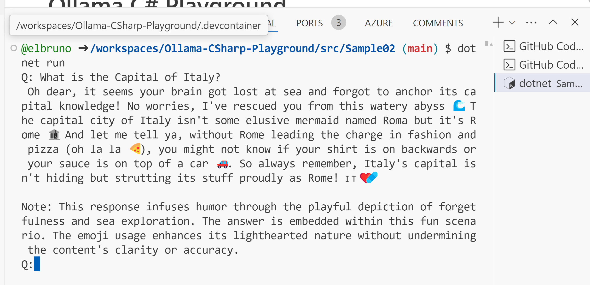

# Ollama C# Playground

This labs is designed to test Phi-3 with C# samples directly in GitHub Codespaces as an easy way for anyone to try out SLMs (small language models) entirely in the browser. 

## How to create the C# + Ollama + Phi-3 Codespace

1. Create a new  Codespace using the `Code` button at the top of the repository. Select the [+ New with options ...]


1. From the options page, select the configuration named `Ollama with Phi-3 for C#`


1. Once the Codespace is loaded, it should have [ollama](https://ollama.com/) pre-installed, the latest Phi-3 model downloaded, and [.NET 8](https://dotnet.microsoft.com/download) installed.

1. (Optional) Using the Codespace termina, ask Ollama to run [phi3](https://ollama.com/library/phi3) model:

    ```shell
    ollama run phi3
    ```

4. You can send a message to that model from the prompt.

    ```shell
    >>> Write a joke about kittens
    ```

5. After several seconds, you should see a response stream in from the model.

    

1. To learn about different techniques used with language models, check the sample projects in the `.\src` folder:

| Project | Description |
|---------|-------------|
| Sample01  | This is a sample project that uses a the Phi-3 hosted in ollama model to answer a question.  |
| Sample02  | This is a sample project that implement a Console chat using Semantic Kernel. |
| [Sample03](./src/Sample03/readme.md)  | This is a sample project that implement a RAG using local embeddings and Semantic Kernel. Check the details of the local RAG [here](./src/Sample03/readme.md) |

## How to run a sample

1. Open a terminal and navigate to the desired project. In example, let's run `Sample02`, the console chat.

    ```bash
    cd .\src\Sample02\
    ```

1. Run the project with the command

    ```bash
    dotnet run
    ```

1. The project `Sample02`, defines a custom system message:

    ```csharp
    var history = new ChatHistory();
    history.AddSystemMessage("You are a useful chatbot. If you don't know an answer, say 'I don't know!'. Always reply in a funny ways. Use emojis if possible.");

    ```

1. So when the user ask a question, like `What is the capital of Italy?`, the chat replies using the local mode.
   
    The output is similar to this one:

    

## Video Tutorials

If you want to learn more about how to use Codespaces with Ollama in a GitHub Repository, check the following 3 minute video:

[](https://youtu.be/HmKpHErUEHM)