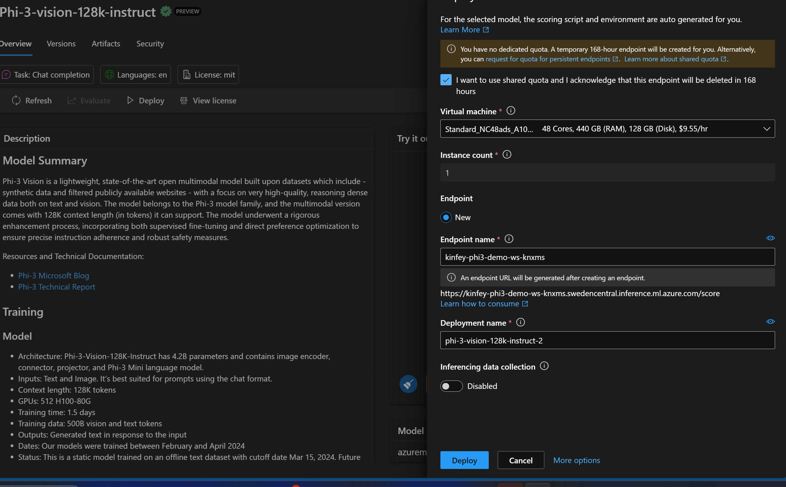

# **Lab 3 - 部署 Phi-3-vision 在 Azure Machine Learning Service**

我們使用 NPU 完成本地程式碼的生產部署，然後我們想介紹通過它引入 PHI-3-VISION 的能力，以實現圖片生成程式碼。

在這個介紹中，我們可以快速建構一個 Model As Service Phi-3 Vision 服務在 Azure Machine Learning 服務中。

***注意***：Phi-3 Vision 需要計算能力來更快地生成內容。我們需要雲端計算能力來幫助我們實現這一點。

### **1. 建立 Azure Machine Learning Service**

我們需要在 Azure Portal 中建立 Azure Machine Learning Service。如果你想學習如何操作，請訪問此連結 [https://learn.microsoft.com/en-us/azure/machine-learning/quickstart-create-resources?view=azureml-api-2](https://learn.microsoft.com/en-us/azure/machine-learning/quickstart-create-resources?view=azureml-api-2)。

### **2. 選擇 Phi-3 Vision 在 Azure Machine Learning Service**


### **3. 部署 Phi-3-Vision 在 Azure**



### **4. 測試端點在 Postman**


***注意***

1. 要傳輸的參數必須包括 Authorization、azureml-model-deployment 和 Content-Type。您需要檢查部署資訊以獲取它。

2. 要傳輸參數，Phi-3-Vision 需要傳輸一個圖像連結。請參考 GPT-4-Vision 方法來傳輸參數，例如

```json

{
  "input_data":{
    "input_string":[
      {
        "role":"user",
        "content":[ 
          {
            "type": "text",
            "text": "你是一個 Python 程式碼助手。請建立 Python 程式碼來處理圖像 "
          },
          {
              "type": "image_url",
              "image_url": {
                "url": "https://ajaytech.co/wp-content/uploads/2019/09/index.png"
              }
          }
        ]
      }
    ],
    "parameters":{
          "temperature": 0.6,
          "top_p": 0.9,
          "do_sample": false,
          "max_new_tokens": 2048
    }
  }
}

```

3. 使用 Post 方法呼叫 **/score**

**恭喜** ！你已經完成了快速 PHI-3-VISION 部署並嘗試了如何使用圖片來生成程式碼。接下來，我們可以結合 NPU 和雲端來建構應用程式。

