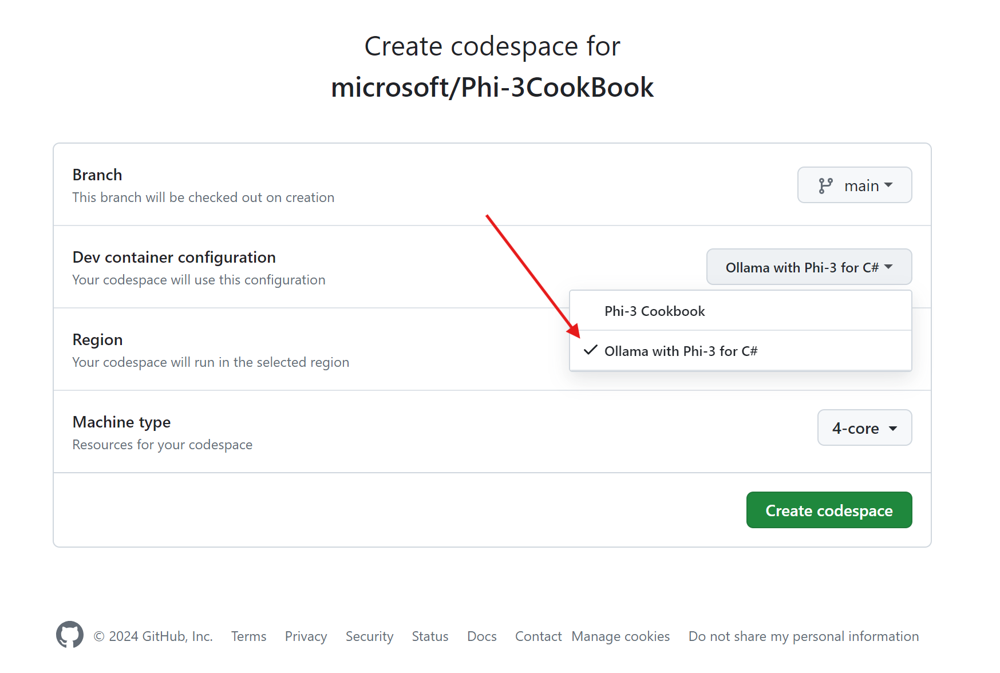

# Ollama C# Playground

本 Lab 旨在直接在 GitHub Codespaces 中使用 C# 示例测试 Phi-3，这为任何人提供一种完全在浏览器中试用 SLM（小语言模型）的简便方法。

## 如何创建 C# + Ollama + Phi-3 的 Codespace

1. 使用仓库顶部的 `Code` 按钮创建一个新的 Codespace。选择 [+ New with options ...]


1. 在选项页面中，选择名为 `Ollama with Phi-3 for C#` 的配置



1. 一旦 Codespace 加载完成，它应该已经预装了 [ollama](https://ollama.com/)、下载了最新的 Phi-3 模型，并且安装了 [.NET 8](https://dotnet.microsoft.com/en-us/download)。

1. （可选）使用 Codespace 终端，让 Ollama 运行 [phi3](https://ollama.com/library/phi3) 模型：

    ```shell
    ollama run phi3
    ```

4. 你可以根据提示向该模型发送消息。

    ```shell
    >>> Write a joke about kittens
    ```

5. 几秒钟后，你应该会看到模型的响应流。

    

1. 要了解使用语言模型的不同技术，请查看 `.\src` 文件夹中的示例项目：

| 项目 | 描述 |
|---------|-------------|
| Sample01  | 使用 Ollama 模型中的 Phi-3 来回答问题。 |
| Sample02  | 使用 Semantic Kernel 实现在终端进行聊天。 |
| [Sample03](./src/Sample03/readme.md)  | 使用本地嵌入模型和 Semantic Kernel 实现 RAG 。查看本地 RAG 的详细信息 [here](./src/Sample03/readme.md) |

## 如何运行示例

1. 打开终端并导航到所需的项目。例如，如果我们想运行 `Sample02`，控制台聊天。

    ```bash
    cd .\src\Sample02\
    ```

1. 使用以下命令运行项目

    ```bash
    dotnet run
    ```

1. 项目 `Sample02` 定义了一个自定义系统消息：

    ```csharp
    var history = new ChatHistory();
    history.AddSystemMessage("You are a useful chatbot. If you don't know an answer, say 'I don't know!'. Always reply in a funny ways. Use emojis if possible.");
    ```

1. 因此，当用户提出问题，如 `What is the capital of Italy?`，聊天会使用本地模式回复。
   
    输出类似于这样：

    

## 视频教程

如果你想了解更多关于如何在 GitHub 仓库中使用 Codespaces 和 Ollama，请查看以下 3 分钟视频：

[](https://youtu.be/HmKpHErUEHM)